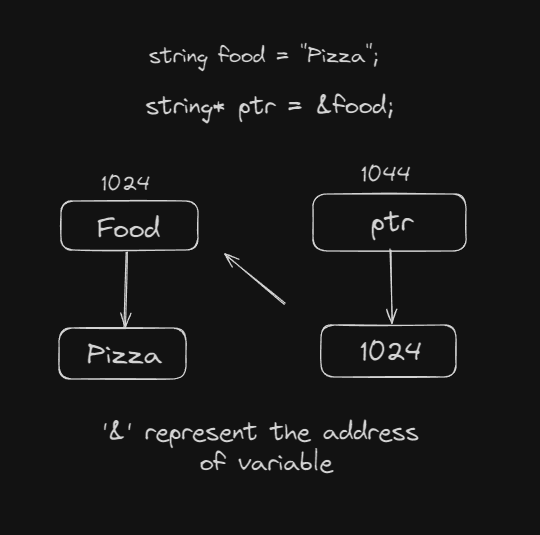

## Pointers

A pointer however, is a variable that stores the memory address as its value.

#### How we can Create It

```cpp
string food = "Pizza";  
string* ptr = &food; 
```

#### Explanation

<p align="center">
  
</p>


### If you want to access the Value through Pointers (Dereference)

Accessing or manipulating the content that is stored in the memory address pointed by the pointer using dereferencing or indirection operator `*` is called dereferencing the pointer.

```cpp
cout << *ptr << "\n";
```