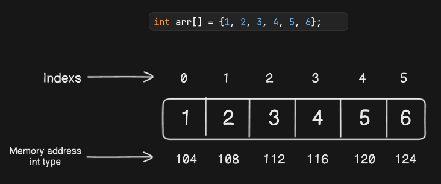
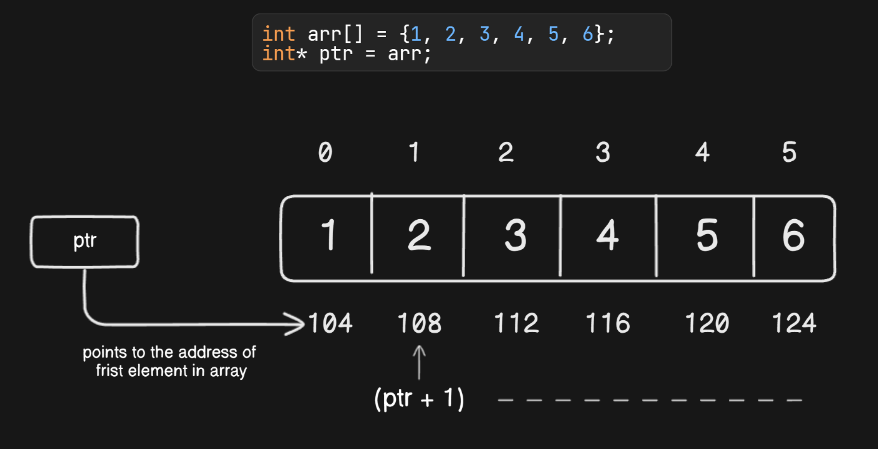

# What is Array?

An array is a collection of elements, all of the same type, placed in contiguous memory locations.

If we want to store multiple value in a single variable then we use array.



*NOTE:* Different datatype of array has different size of memory allocated. So the memory address changes accordingly.

#### How can we create and access array ?

```c++
// Declaration
int arr[10];           // This creates an array named arr capable of holding 10 values


// Initialization
int arr[5] = {1, 2, 3, 4, 5};       // This initializes arr with 5 elements

// Shorthand
int arr[] = {1, 2, 3, 4, 5};        // Initialize Array with Values and without Size

// user initialization
for (int i = 0; i < N; i++) {       // Initialize Array after Declaration
    arr[i] = value;
}

// Initialize an array partially
int partialArray[5] = {1, 2};       // rest of the indices '0' is stored

// Initialize the array with zero
int zero_array[5] = {0};            //  all elements as '0'


// Accessing Element in Array

// using index
int firstElement = arr[0];

// using loop
for (int i = 0; i < 5; i++) {
    cout << arr[i] << " ";
}
```

#### 2D Arrays

A two-dimensional array in C++ is a collection of elements organized in rows and columns. It can be visualized as a table or a grid, where each element is accessed using two indices: one for the row and one for the column.

A two-dimensional array is also called a matrix. It can be of any type like integer, character, float, etc. depending on the initialization

```cpp
// Initializing
int matrix[3][3] = {
        {1, 2, 3},
        {4, 5, 6},
        {7, 8, 9}
    };

// Accessing Element
cout << matrix[1][2] << endl;

// Printing
for (int i = 0; i < 3; ++i) {
    for (int j = 0; j < 3; ++j) {
        cout << matrix[i][j] << " ";
    }
    cout << endl;
}
```

#### How can we determine the size of an array ?

1. `sizeof` Operator: `sizeof(arr)` gives the total memory occupied by the array. `sizeof(arr[0])` gives the memory occupied by a single element.  Dividing the total memory by the memory of one element yields the number of elements.

```cpp
int arr[] = {1, 2, 3, 4, 5};
int size = sizeof(arr) / sizeof(arr[0]);  // Size of the array
```

2. **Using Standard Library:** you can use the `size()` member function.

```cpp
#include <iostream>
#include <array>            // library
using namespace std;

int main() {
    array<int, 5> arr = {1, 2, 3, 4, 5};
    cout << "Size of array: " << arr.size() << endl;
    return 0;
}
```

#### How can we create pointers in array?

Pointers in C++ are variables that store the address of another variable while arrays are the data structure that stores the data in contiguous memory locations.

In C++, we can manipulate arrays by using pointers to them. These kinds of pointers that point to the arrays are called array pointers or pointers to arrays

A pointer can point to the first element of an array. The name of an array is considered as a pointer, i.e, the name of an array contains the address of an element.

```cpp
int arr[] = {1, 2, 3, 4, 5};
int* ptr = arr;                 // ptr points to the first element of arr

cout << *ptr << endl;           // Output: 1
```



if `ptr` points to the first element `arr[0]`, then `ptr + i` points to the i-th element `arr[i]`
The `*` operator is the dereference operator. It accesses the value at the memory location pointed to by the pointer.


#### Passing Arrays as Arguments

In C++, arrays are typically passed to functions by reference using pointers. This allows functions to modify the original array

*NOTE:* If you are sending an array to a function then you not actually sending array to array to a function  insted you are sending the address of frist block of array.

```cpp
void printArray(int arr[], int size) {
    // code
}

int main() {
    int size = 5;
    int arr[] = {1, 2, 3, 4, 5};
    printArray(arr, size);
    return 0;
}
```

##### Passing Array to Function Using a Pointer

When you pass an array to a function, it is passed as a pointer to the first element of the array. This method allows the function to access and modify the original array

```cpp
void printArray(int* arr, int size) {
    // code
}

int main() {
    // code
    printArray(arr, size);
}
```

#### Returning Arrays from Functions
    
Returning arrays directly from functions is not straightforward because arrays in C++ decay to pointers. 
    
##### Using static Array

The lifetime of a static variable is throughout the program. So we can always create a local static array and return it.

```cpp
int* demo() {
	static int arr[5];        //array declared as static
    // Some operations on arr[]

	return arr;     // address of a returned
}

int main() {
    int* ptr = demo();      // address of arr
    cout << ptr[0] << " " << ptr[1];
    return 0;
}
```

##### Using Dynamically Allocated Array

Dynamically allocated memory (allocated using `new` or `malloc()`) remains there until we delete it using the delete or `free()`. So we can create a dynamically allocated array and we can delete it once we come out of the function

```cpp
int* createArray(int size) {
    int* arr = new int[size];       // memory created
    // Some operations on arr[]

    return arr;
}

int main() {
    int size = 5;
    int* arr = createArray(size);
    cout << arr[1] << " ";
    delete[] arr;                   // memory deleted
    return 0;
}
```
