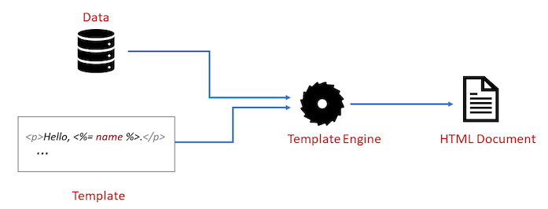

## What is EJS? :japanese_ogre:

EJS, or Embedded JavaScript, is a templating language used to generate HTML markup with plain JavaScript. It allows you to embed JavaScript code directly within your HTML templates, enabling dynamic content rendering on the server side before sending the final HTML to the client.

EJS files are saved with the `.ejs` file extension

**EJS syntax**

```ejs
<startingTag content closingTag>

<%= user.firstName %>
```
This start tag `<%=` is called the “escape output” tag.

This `<%-` is called the “unescaped output” tag. It is used when you want to output raw HTML.


#### Template engines

Template engines are tools used in web development to dynamically generate HTML pages by combining templates with data. They enable developers to separate the logic of data handling from the presentation layer, which helps in maintaining clean and manageable code.

<p align="center">
  
</p>

#### How to set up EJS in a Node.js application

1. First, install EJS:

```js
npm install ejs
```

2. Create a new `index.js` file and open it with your code editor.

3. Now setting EJS as the Express app view engine.

```js
app.set('view engine', 'ejs')
```

4. Now create a `view` folder in root. Inside the views folder, create two folders `pages` and `partials`.

- EJS Partials: Like a lot of the applications you build, there will be a lot of code that is reused. These are considered partials. Like navbar, footer etc.

- Pages: These are the main pages which is going to be rendered like Home page, about page etc.

By default, Express will look inside of a views folder when resolving the template files, which is why we had to create a views folder.

5. In `res.render('pages/index')`, we are calling the render method on the response object. This renders the view provided (`pages/index` in this case) and sends back the rendered HTML string to the client.


#### Code

**Creating `index.js` file**

```js
var express = require('express');
var app = express();

// set the view engine to ejs
app.set('view engine', 'ejs');

// use res.render to load up an ejs view file

// index page
app.get('/', function(req, res) {
  res.render('pages/home');         // name must be same as the filename 
});

app.listen(3000);
console.log('Server is listening on port 3000');
```
<br>

**Creating partial `navbar.ejs` file**

```ejs
<nav class="navbar navbar-expand-lg navbar-light bg-light">
  <a class="navbar-brand" href="/">EJS Is Fun</a>
  <ul class="navbar-nav mr-auto">
    <li class="nav-item">
      <a class="nav-link" href="/">Home</a>
    </li>
    <li class="nav-item">
      <a class="nav-link" href="/about">About</a>
    </li>
  </ul>
</nav>
```
<br>

**Adding partial file `navbar.ejs` into page `home.ejs` file**

```ejs
<!DOCTYPE html>
<html lang="en">
<head>
  <%- include('../partials/navbar'); %>
</head>
<body class="container">
  <div class="jumbotron">
    <h1>This is great</h1>
    <p>Welcome to templating using EJS</p>
  </div>
</body>
</html>
```

#### Passing data to render

Recall that our aim is to combine data with templates. We can do that by passing a second argument to `res.render`. This second argument must be an object, which will be accessible in the EJS template file.

```js
const app = express()
app.set('view engine', 'ejs')

const user = {
    firstName: 'Tim',
    lastName: 'Cook',
    admin: true,
}
app.get('/', (req, res) => {
    res.render('pages/index', {
        user: user                  // we are sending 'user' to ejs template
    })
})
```

```ejs
<h1>Hi, I am <%= user.firstName  %></h1>
<% if (user.admin) { %>
    <p>Let me tell you a secret: <b>I am an admin</b></p>
<% } %>
```


#### Passing Data to a Partial file

EJS makes it easy, because a partial files has access to every variable in the parent view, so we just have to pass the variable in the object alongside the call to `res.render`.

```js
app.get('/', (req, res) => {
    res.render('pages/index', {
        user,
        title: "Home Page"         // This is passed to a variable  
    })
})
```

You can also pass a variable to a partial when you include it as follows:

```ejs
<%- include('../partials/head', {title :'Page Title'}) %>
```

Variables passed this way take precedence over variables passed through render method.


<br>
<br>

--- 📄 Document End Here! 🎉 -----