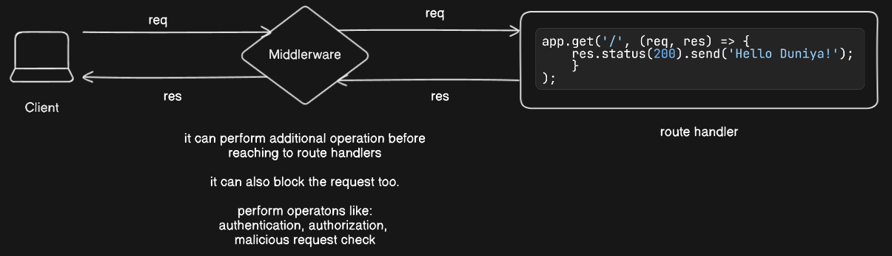

# Middleware 🦾

Middleware in Express is a function that acts as a bridge between an incoming request and the route handler. It allows you to execute some logic before the request is sent to the route handler. For example, you can use middleware to authenticate users, parse data, or add headers to the response.

Middleware in Express.js refers to functions that are executed during the request-response cycle. 

Middleware functions have access to the request object `req`, the response object `res`, and the `next` middleware function in the application’s request-response cycle.

`next():` The next() function is a function in the Express router, when invoked, executes the next middleware in the middleware stack.

- If the current middleware function does not end the request-response cycle, it must call `next()` to pass control to the next middleware function. Otherwise, the request will be left hanging.

- When we have multiple middleware functions, we need to ensure that each of our middleware functions either calls the `next()` function or sends back a response.

`app.use():` We use the `app.use()` method to attach the middleware to the Express app. When a request is received, the middleware function is executed first, then the route handler is executed.

**Example:** Consider an authentication middleware that ensures users are logged in before they can access certain routes. This middleware intercepts the request, checks if the user is authenticated, and either lets them proceed or redirects them to the login page.

### Middleware functions can perform the following tasks:

 - Execute any code.
 - Make changes to the request and the response objects.
 - End the request-response cycle.
 - Call the next middleware in the stack.



## Types of Middleware

#### Application-Level Middleware

We might also want to perform some common processing for all the routes and specify them in one place instead of repeating them for all the route definitions. Examples of common processing are authentication, logging, common validations, etc.

```javascript
const express = require('express');
const app = express();

const requestLogger = (request, response, next) => {
    console.log(`${request.method} url:: ${request.url}`);
    next();         // Pass control to the next middleware
}

app.use(requestLogger);

app.get('/', (req, res) => {
  res.send('Home Page');
});
```

Now when we visit `http://localhost:3000` or any other route in this application, we can see the HTTP method and URL of the incoming request object in the terminal window

<br>

#### Route-Specific Middleware

Route-specific middleware in Express.js allows you to apply middleware functions to particular routes or groups of routes. This approach helps in organizing and optimizing middleware logic by applying it only where necessary, rather than globally to all routes.

```javascript
const app = express();

// Middleware function
const logRequestDetails = (req, res, next) => {
  console.log(`Request URL: ${req.originalUrl}`);
  next(); 
};

// Apply middleware to a specific route
app.get('/product/:id', logRequestDetails, (req, res) => {
  res.send(`Product ID: ${req.params.id}`);
});

app.get(     
  '/user/:id', 
  (req, res, next) => {             // you can use middleware in this way
    console.log('middleware Run 1');
    next();
  },
  (req, res, next) => {             
    res.send({ name: 'John', age: 30 });
  }
);
```

<br>

#### Error-Handling Middleware

Express comes with a default error handler that takes care of any errors that might be encountered in the application. The default error handler is added as a middleware function at the `end` of the middleware function stack.

The error handling middleware functions are attached after the route definitions.

It is distinguished from other middleware by its signature, which has four arguments instead of three: `(err, req, res, next)`.

```javascript
const app = express();

app.use((req, res, next) => {
  console.log('middleware Run 1');
  next();
});

app.get('/', (req, res) => {
  res.send('Home Page');
});

// Middleware to simulate an error
app.get('/error', (req, res, next) => {         //  Inline Middleware
  next(new Error('Simulated Error'));
});

// Error-handling middleware
app.use((err, req, res, next) => {
  console.error(err.stack);
  res.status(500).send('Something broke!');
});
```

<br>

#### Built-in Middleware

Built-in middleware functions are bundled with Express so we do not need to install any additional modules for using them.

- `express.static:` serves static assets
- `express.json:` parses JSON payloads
- `express.urlencoded:`	parses URL-encoded payloads
- `express.raw:` parses payloads into a Buffer and makes them available under req.body
- `express.text:` parses payloads into a string

```javascript
const app = express();

// Parse JSON payloads
app.use(express.json());

// Parse URL-encoded payloads
app.use(express.urlencoded({ extended: false }));

// Serve static files
app.use(express.static('public'));

app.post('/data', (req, res) => {
  res.send(`Received JSON data: ${JSON.stringify(req.body)}`);
})
```

<br>

#### Third-Party Middleware

We can also use third-party middleware to add functionality built by the community to our Express applications. These are usually available as npm modules which we install by running the `npm install` command in our terminal window.

The following example illustrates installing and loading a third-party middleware named `Morgan` which is an HTTP request logging middleware for Node.js

First install the package using `npm install morgan` or  `yarn install morgan`

```javascript
const express = require('express')
const morgan = require('morgan')

const app = express()

app.use(morgan('dev'));

app.get('/', (req, res) => {
  res.send('Home Page');
});
```

<br>

**Multiple Middleware Functions:** use multiple middleware functions for a single route.

```javascript
app.get(
    '/path', 
    (req, res, next) => {                   //  Inline Middleware
        console.log('First middleware');
        next();
    }, 
    (req, res, next) => {
        console.log('Second middleware');
        next();
    }, 
    (req, res) => {
        res.send('Final response');
    }
);
```

<br>

### Middleware as a Module

You can define middleware in separate files and import them into your main application. This is useful for keeping your code organized.

```javascript
// logger.js
module.exports = (req, res, next) => {
  console.log('Logged');
  next();
};
```

```javascript
// index.js
const express = require('express');
const logger = require('./logger');
const app = express();

app.use(logger);

app.get('/', (req, res) => {
  res.send('Home Page');
});

app.listen(3000);
```

### Best Practices for Using Middleware

- **Keep Middleware Functions Reusable:** Write middleware functions that can be reused across different routes.

- **Organize Middleware:** Place middleware in separate files or directories if they are complex or numerous.

- **Error Handling:** Always have a default error-handling middleware function to catch errors.

- **Use next() Properly:** Ensure next() is called to pass control to the next middleware. Failure to do so can hang requests.

- **Optimize Middleware Order:** The order in which middleware is applied can affect performance. Place frequently used or performance-critical middleware at the top.


### Use cases of middleware

- **Authentication:** You can use middleware to authenticate users before allowing them to access certain routes.

- **Data parsing:** You can use middleware to parse incoming data, such as JSON or form data, so that it can be easily accessed in your route handlers.

- **Error handling:** You can use middleware to handle errors that occur during the processing of requests.

- **Logging:** You can use middleware to log information about requests, such as the request method, IP address, and request/response time.

- **CORS:** You can use middleware to handle Cross-Origin Resource Sharing (CORS) and set appropriate headers to control who can access your API.

- **Static file serving:** You can use middleware to serve static files, such as images, CSS, and JavaScript files, from your Express application.


<br>

--- 📄 Document End 🎉 -----