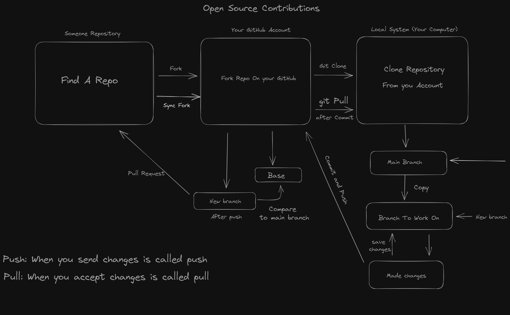

## What is Git 💻

Git is a version control system that allows you to track changes to your files and collaborate with others. It is used to manage the history of your code and to merge changes from different branches

It is a distributed version control system, every developer has a full copy of the project and project history. Unlike once popular centralized version control systems, DVCSs don't need a constant connection to a central repository. 


## What is Github 🤖

Github is a web-based hosting service for Git repositories, built around the Git version control system. It provides a range of tools and services to facilitate the management of Git repositories, enabling teams and individuals to work together on code, track changes, and manage projects.


### What is Version Control

Version Control is a system that records changes to files over time, allowing you to track and manage versions of these files. It is widely used in software development to manage source code.

Version control systems are software that help track changes make in code over time. As a developer edits code, the version control system takes a snapshot of the files. It then saves that snapshot permanently so it can be recalled later if needed.

Version control systems are essential for software development. Consider version control as a checkpoint in game. 


## Comman Terminology

- **Repository (Repo):** A repository is a collection of files and directories that are stored together. It is a way to store and manage your code. A repository is like a folder on your computer, but it is more than just a folder. It can contain other files, folders, and even other repositories. You can think of a repository as a container that holds all your code.

- **Commit (Revision):** A snapshot of the working directory at a specific point in time, recorded in the repository. It is a way to record your changes and make them permanent. It includes metadata like the author, timestamp, and a commit message.

- **Branch:** A parallel version of the repository, used to develop features or fixes independently from the main codebase. It acts as a pointer to a snapshot of your changes. This allows you to work on different features or bug fixes without affecting the main branch.

- **Merge:** The process of combining changes from one branch into another.

- **Conflict:** A conflict arises when merging branches that have competing changes in the same part of a file. Git cannot automatically resolve these discrepancies, so manual intervention is required to decide which changes to keep.

- **Fork:** A personal copy of someone else’s repository on platforms like GitHub. Allows you to experiment without affecting the original repository.

- **Clone:** To clone a repository means to create a local copy of a remote repository. This includes all the files, branches, and history, enabling you to work on the project offline.

- **Pull:** Pulling involves fetching and integrating changes from a remote repository into your local branch. It combines the actions of fetch (downloading new data) and merge (integrating it into your working branch).

- **Push:** Pushing means uploading your local commits or changes to a remote repository. It updates the remote branch with the changes made locally.

- **Tracking:** Tracking a file means Git is aware of the file and monitors its changes. When you track a file, Git includes it in version control, allowing you to commit changes to the file and manage its history.

- **Untracking:** Untracking a file means removing it from Git’s monitoring so that changes to the file are no longer included in future commits. Untracked files can still exist in your working directory, but Git will ignore them.

<br>

## Steps to Setup a Git

- Install Git: Download and install Git from the official Git [website](https://git-scm.com/).

- Configure Git: Set up your username and email.

    ```git
    git config --global user.name "Your Name"
    git config --global user.email "your.email@example.com"
    ```


## How the Git Works ⚙️

<p align="center">
  
</p>


<br>

--- 📄 Document End 🎉 -----


