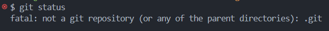
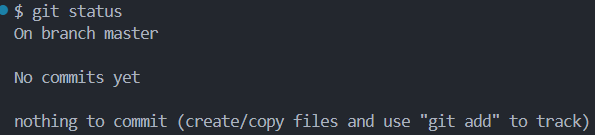

## Step-by-Step Guide: Create and Publish a Project to GitHub Using Git ⚒️

### Create and initilaize Project

1. **Create a New Project:** Create a directory and add some folders and your project files or code.

```bash
mkdir new-project
cd new-project
```

**NOTE:** Alyways check the `status` frist before perform any operation on the directory using git.

```bash
git status
```

<h4>before initilaization</h4>

<p align="center">
  
</p>


2. **Initialize a Git Repository:** Initialize a new Git repository in the directory.

```bash
git init
```

This creates a `.git` directory that tracks changes in your project. This adds a hidden `.git` folder to your project.

<h5>After initilaization</h5>

<p align="center">
  
</p>

<br>

### Commit the Project Locally

1. **Stage Files:** Stage your files using `git add`. This tells Git to include these files in the next commit.

```bash
git add <file> <file2>

# add all files
git add .
```

**Remove a file**
```bash
git rm --cached <file>
```

2. **Commit Files:** Commit your files with a descriptive message. This saves the snapshot of your files to the local Git repository.
```bash
git commit -m "Frist Commit"    #  -m flag is used to add a message to the commit.
```

<br>

### Publish on GitHub

Make sure frist you configure the SSH key. Vist [docs](https://docs.github.com/en/authentication/connecting-to-github-with-ssh/generating-a-new-ssh-key-and-adding-it-to-the-ssh-agent) 

1. **Create a New Repository:** Click the + icon in the top-right corner and select New repository. Make sure create empty repository, do not initialize the repository with a `README`, .`gitignore`, or `license` if you already have these locally.

2. **Check remote url setting:** You can check the remote url setting by running the following command

```bash
git remote -v
```
- if it shows nothing then go further.

3. **Change the name of branch (optionsl):** if you want to change the name of branch use the following command

```bash
git branch -M main
```

4. **Add Remote:** Add the URL of the GitHub repository as a remote to your local Git repository.

```bash
git remote add origin https://github.com/<your-username>/<repository-name>.git
```

5. **Add Remote:** Check if the remote has been added correctly

```bash
git remote -v

# output
origin  https://github.com/your-username/repository-name.git (fetch)
origin  https://github.com/your-username/repository-name.git (push)
```

6. **Push Changes:** Push your local commits to the GitHub repository. This step uploads your code to GitHub

```bash
git push -u origin main
```

- The `-u` flag sets the origin remote as the default for the main branch, so you can simply use git push in future pushes.


<br>


### All about branches in Git

Branches are a way to work on different versions of a project at the same time. They allow you to create a separate line of development that can be worked on independently of the main branch. 

This can be useful when you want to make changes to a project without affecting the main branch or when you want to work on a new feature or bug fix.

### HEAD in git

The `HEAD` is a pointer to the current branch that you are working on. It points to the latest commit in the current branch. When you create a new branch, it is automatically set as the HEAD of that branch.

### Commands

**Listing Branches:** List all local branches using `git branch`.
```bash
git branch    
```

**Creating a Branch:** Use `git branch` to create a new branch. This branch will start at the current commit.
```bash
git branch <name>

gti branch dev          # example
```

**Switching Branches:** Use `git switch` to switch to an existing branch.
```bash
# Method - 1
git switch <name>         # new version

git switch dev            # example

# Method - 2
git checkout dev
```

**Switch and Create Branch:** You can also create and switch to the new branch in one command using `git switch -c`
```bash
git switch -c bug-fix  

git checkout -b bug-fix
```

**Merging Branches:** To integrate changes from one branch into another, use `git merge`
```bash
# Switch to the branch where you want to merge changes
git checkout main

# Merge another branch into the current branch
git merge dev   
```
 
- **NOTE:** Always remeber, frist switch to the branch where you wana merge changes, then merge the specific branch. 

- **There are some cases also exist**

> **Case 1:** When you don't have changes in main branch and changes only present on another branch. In that case you can easily merge changes witout conflicts.

> **Case 2:** When you have changes in main branch and another branch but no changes present on the same file. In that case you can merge changes witout conflicts but it will show extra commit message.

> **Case 3:** When you have changes in main branch and another branch but changes present on the same file. In that case the conflicts arises and you have to fix it on your own.

- **Abort Merge:** It will abort the merge you face conflicts and keep data safe.
```bash
git merge --abort
```


**Renaming a Branch:** Rename the current branch using `-m`.
```bash
git branch -m <old-branch-name> <new-branch-name>   
```

**Deleting a Branch:** Delete a local branch using `-d`.
```bash
git branch -d <branch-name>    

git branch -D branch-name           # Use -D to force delete
```

**Rebasing Branches:** Rebase integrates changes from one branch into another by moving or `rebasing` commits.
```bash
# Switch to the branch you want to rebase
git checkout new-feature

# Rebase onto another branch
git rebase main    
```


### How can we manage conflicts

**conflicts:** A conflict arises when merging branches that have competing changes in the same part of a file. Git cannot automatically resolve these discrepancies, so manual intervention is required to decide which changes to keep.

1. Make sure you are on correct branch use  `git branch`

2. **Inspect Conflicted Files:** Conflicted files are marked in the working directory. You can list them using `git status`

 - Inside the conflicted file, Git uses conflict markers to highlight the conflicting sections

```bash
<<<<<<< HEAD
Current change in the branch you're on
=======
Change in the branch you're merging or rebasing
>>>>>>> branch-being-merged
```

3. **Edit Conflicted Files:** Open the conflicted files in a text editor or integrated development environment (IDE). Resolve conflicts by deciding what the final content should be. You can:

- Keep changes from both sides: Manually combine changes from both versions.
- Choose one side: Keep changes from either the current branch or the branch being merged.

4. **Mark Conflicts as Resolved:** After resolving the conflicts, mark the file as resolved using `git add <filenames>`

5. **Commit changes:** And after all that commit all the changes using `git commit -m "Conflict Resolved"`

**NOTE:** Rember all the above things are performed on main(master) branch only so no other branches have this change you have to pull the changes frist using `git pull` or use `rebase` 


<br>

--- 📄 Document End 🎉 -----