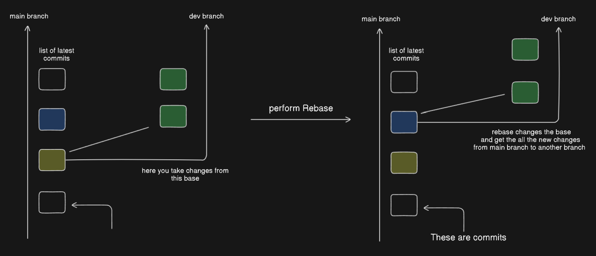
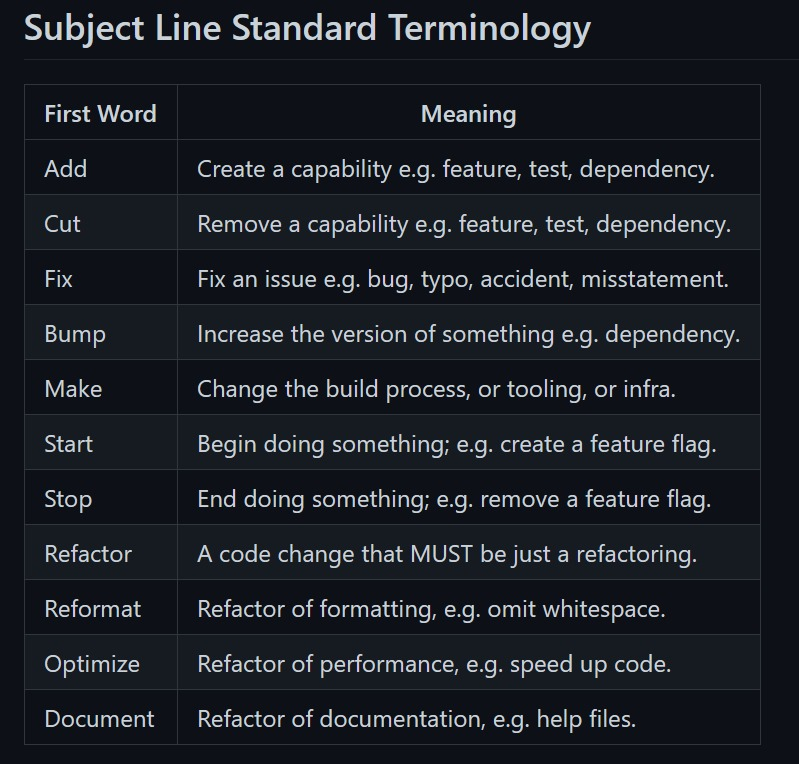

## Atomic commits 

Atomic commits are a way to make sure that each commit is a self-contained unit of work. This means that if one commit fails, you can always go back to a previous commit and fix the issue. This is important for maintaining a clean and organized history in your repository.

**Why Atomic Commits?**

- **Clarity:** Each commit addresses a single issue or feature, making the purpose of the commit clear.

- **Traceability:** Makes it easier to track down specific changes and understand the context of those changes.

- **Isolation:** If a bug is introduced, it can be easier to isolate the offending change because each commit is atomic.

<br>

## Git files

**.gitignore:** It is a special file in Git used to specify which files and directories should be ignored by Git when performing operations such as adding, committing, and pushing. 

This is essential for keeping your repository clean and free from unnecessary files like build artifacts, logs, and temporary files that do not need to be version controlled.


**.gitkeep:** is a placeholder file used in Git to ensure that empty directories are tracked in a repository. Git does not allow empty directories to be committed, so `.gitkeep` serves as a workaround to include such directories.

**Why Use .gitkeep?**

- **Track Empty Directories:** Allows you to include directories that are currently empty but are expected to hold files in the future.

- **Maintain Directory Structure:** Helps in maintaining a specific directory structure that is essential for the project but doesn’t currently contain any files.

<p align="center">
  
</p>

<br>

## Porcelain Commands & Plumbing Commands or Tooling Commands

**Porcelain Commands**

- Porcelain commands in Git refer to user-facing, high-level commands that abstract the more complex lower-level operations. 
- These commands are typically what developers use day-to-day to interact with the repository. They are designed to be easy to use and understand, providing a simpler interface over Git's underlying mechanisms.

**Examples of Porcelain Commands:**

- `git status` Shows the working tree status.
- `git add` Adds changes to the staging area.
- `git commit` Records changes to the repository.
- `git push` Updates remote refs along with associated objects.
- more...

<br>

**Plumbing Commands**

- Plumbing commands are the lower-level commands in Git that provide more direct access to the internal operations of Git. 
- These commands are not typically used for daily operations but can be useful for scripting or more advanced manipulation of the repository. They offer more granular control and visibility into Git's internal workings.

**Examples of Plumbing Commands:**

- `git hash-object` Computes the object ID of a file or stores a file in the object database.
- `git cat-file` Provides content or type and size information for repository objects.
- `git update-index` Updates the index file for the working directory.
- `git rev-parse` Parses revision (commit, branch, tag) identifiers.
- `git ls-tree` Lists the contents of a tree object.

<br>

## Rebase and reflog

<h4>Git Rebase</h4>

Git rebase is a powerful Git feature used to change the base of a branch. It effectively allows you to move a branch to a new starting point, usually a different commit, by “replaying” the commits from the original base onto the new base. This can be useful for keeping a cleaner, linear project history.

rebase is useful for maintaining a cleaner project history, especially when working collaboratively or when preparing a series of commits for integration into a project.

**Explanation**

<p align="center">
  
</p>

Rebase is a powerful tool in Git that allows you to move a branch to a new starting point. It effectively replays the commits from the original base onto the new base. This can be useful for keeping a cleaner, linear project history.

**NOTE:** Always ensure you are on the branch you want to rebase. Rebase is never performed on `main` or `master` branch.

```bash
git switch feature-branch
git rebase main
```

<br>

We use rebase to avoid extra commits when merging branches. Rebase merge the branches and doesn't show extra commits on logs.

<br>

<h4>Git Reflog</h4> 

Git reflog is a command that shows you the history of your commits. It allows you to see the changes that you have made to your repository over time. This can be useful for debugging and understanding the history of your project.

Unlike the regular Git log, which only shows the history of committed changes, the reflog provides a history of all changes to the HEAD, including actions like checkouts, resets, and merges. This is particularly useful for recovering lost commits or navigating through changes.

**Why we use it**

- **Reference Log:** Tracks all movements of branch tips and other references.
- **Recovery:** Useful for recovering commits that have been orphaned or accidentally removed.

**Viewing Reflog**

```bash
git reflog          # To view the reflog for the current branch
```

**Recover lost commits or changes**

If you accidentally deleted a branch or made changes that are no longer visible in the commit history, you can often recover them using the reflog. First, find the reference to the commit where the branch or changes existed, and then reset your branch to that reference.

```bash
git reflog <commit-hash>
git reset --hard <commit-hash>
```

<br>

## How should a commit message written

Writing effective commit messages in Git is crucial for maintaining a clear and informative project history. A well-written commit message helps you and your collaborators understand the context and purpose of changes, making code easier to review, debug, and maintain.

<p align="center">
  
</p>


<br>

--- 📄 Document End 🎉 -----