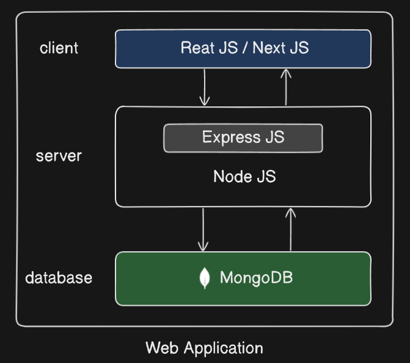
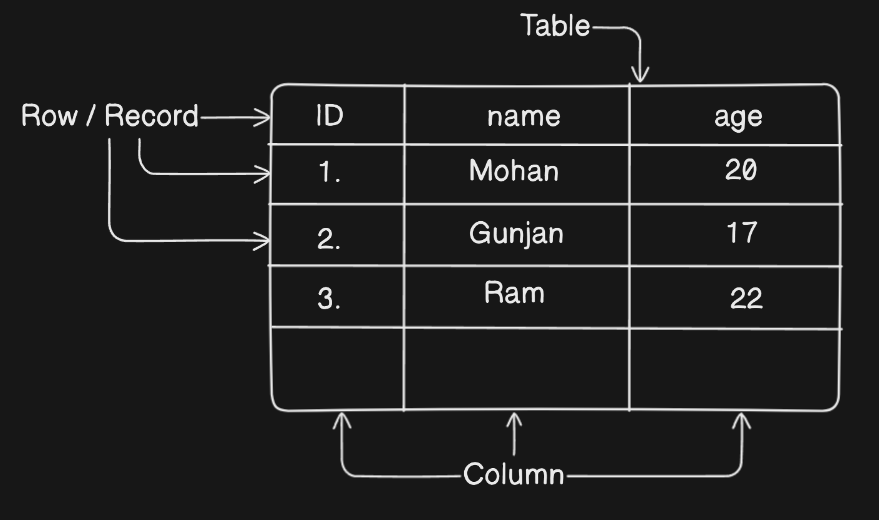
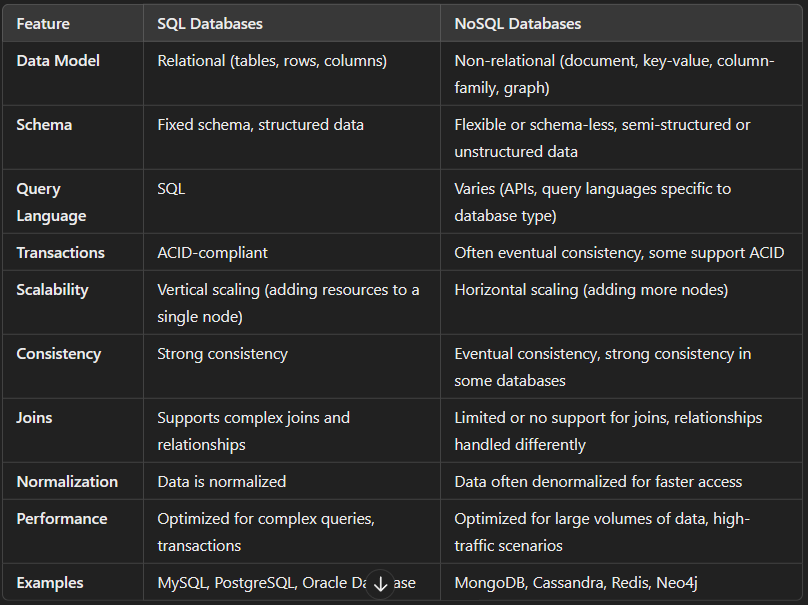
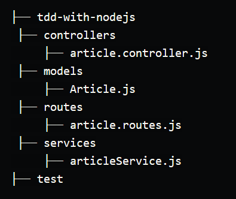
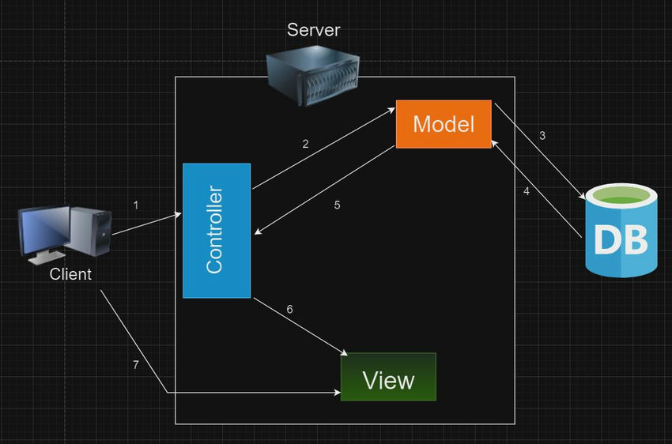

# Introduction to MongoDB 🍃

MongoDB is a NoSQL database designed for storing, querying, and managing document-oriented information. Unlike traditional relational databases that use tables and rows, MongoDB uses collections and documents.

The MongoDB database contains collections just like the MYSQL database contains tables. You are allowed to create multiple databases and multiple collections

#### Architecture of Web Application

<p align="center">
  
</p>

#### Basic Concepts

**Database:** A container for collections.
**Collection:** A group of documents, akin to a table in a relational database.
**Document:** A set of key-value pairs, represented in (BSON - Binary JSON) format, similar to a row in a relational table but can include nested arrays and objects.
**Field:** A key-value pair within a document.

##### Example Document

```json
{
  "_id": 1,
  "name": {
    "first": "Ada",
    "last": "Lovelace"
  },
  "title": "The First Programmer",
  "interests": ["mathematics", "programming"]
}
```

### What is BSON (Binary JSON)

BSON, which stands for Binary JSON (JavaScript Object Notation), is a binary-encoded serialization format used to store and transfer data in MongoDB and other systems. 

BSON is similar to JSON in terms of data types and structure but is optimized for efficient encoding and decoding, particularly for use with MongoDB's database.

The data stored in the MongoDB is in the format of BSON documents. In the backend, the MongoDB server converts the JSON data into a binary form that is known as BSON and this BSON is stored and queried more efficiently.

BSON is the format used both for data storage and network transfer in MongoDB. After storing data in MongoDB, you may want to get your data back as JSON, among many other formats. 

When you want to export your files as JSON, you can use MongoDB’s database tool, `bsondump`, to convert BSON documents to JSON.

#### How BSON is Stored in MongoDB Database

Let’s take the following JSON document example

```json
{
    "hello" : "world"
}
```

<br>

When storing the JSON document, it will be converted to the following.

```json
\x16\x00\x00\x00             // total document size
\x02                         // 0x02 = type String
hello\x00                    // field name
\x06\x00\x00\x00world\x00    // field value (size of value, value, null terminator)         
\x00                         // 0x00 = type EOO ('end of object')
```


### What is Database Server

A database server is a specialized computer program or system that manages databases. 

A database server runs a database management system and provides database services to clients. The server manages data access and retrieval and completes clients’ requests. Its primary role is to store, manage, and retrieve data efficiently.

#### Functions:

- **Data Storage:** Manages persistent data in structured or unstructured formats.
- **Data Management:** Handles indexing, transactions, and data integrity.
- **Query Processing:** Executes queries, optimizes them, and returns results.
- **Concurrency Control:** Manages access by multiple users simultaneously.
- **Backup and Recovery:** Ensures data can be restored in case of failure.
- **Security:** Implements authentication and authorization to protect data.
- **Transactions:** Ensures data integrity through ACID properties (Atomicity, Consistency, Isolation, Durability).

#### How Does a Database Server Work?

The database server stores the Database Management System (DBMS) and the database itself. Its main role is to receive requests from client machines, search for the required data, and pass back the results.

<p align="center">
  
</p>


### Difference between Database Server and Node JS Server

##### Database Sever

A database server is specialized software or hardware designed to provide database services to client applications. Its main functions revolve around managing, storing, and retrieving data efficiently.

##### Node JS Sever

A Node.js server runs on the Node.js runtime and is used to build scalable network applications using JavaScript. It handles HTTP requests and responses, manages application logic, and provides APIs.

It accept the request from the client and processes these request, communicates with the database server and send data to clients.


### Difference between SQL and NOSQL Databases

SQL (Structured Query Language) and NoSQL (Not Only SQL) databases serve different purposes and use cases in data management.

#### What is SQL Databases ?

SQL databases are based on a structured schema and use SQL (Structured Query Language) for defining and manipulating data. They follow a relational data model, which organizes data into tables with rows and columns.

SQL databases use a relational model that work best with well-defined structured data, such as names and quantities, in which relations exist between different entities.

SQL databases are scalable vertically, meaning that you can increase the maximum load by adding further storage components like RAM or SSD.

Examples: MySQL, PostgreSQL, Oracle Database, Microsoft SQL Server.

##### Basic Components

- **Tables:** Tables are the primary structure used to store data in SQL databases. Each table consists of rows and columns, similar to a spreadsheet.

- **Columns:** Columns define the attributes of the data stored in a table. Each column has a specific data type and holds a value for each row.

- **Rows:** Rows (also known as records or tuples) represent individual data entries in a table. Each row contains a value for each column in the table.


<p align="center">
  
</p>

<br>

#### What is NoSQL Databases ?

NoSQL databases are non-relational databases that store data in a manner other than the tabular relations used within SQL databases. While SQL databases are best used for structured data, NoSQL databases are suitable for structured, semi-structured, and unstructured data.

NoSQL databases are designed for flexible, scalable data storage without requiring a fixed schema. They support various data models like document, key-value, column-family, and graph.

NoSQL databases are scalable horizontally, meaning that they use multiple nodes in a cluster to handle increased workloads. 

NoSQL uses non-tabular data models, which can be document-oriented, key-value, or graph-based. 

Examples: MongoDB, Cassandra, HBase, Redis, Neo4j, and CouchDB.

##### Basic Components

- **Collections:** Groups of documents, analogous to tables in SQL.
- **Documents:** Individual records, similar to rows in SQL but more flexible in structure.
- **Fields:** Attributes within documents, similar to columns in SQL.

```json
[                                   // Collection
    {                               // Document 1
        "_id": "unique_id_123",     // Fields 1
        "name": "Alice",            // Fields 2
        "skills": ["JavaScript", "Node.js"]
    }, 
    {                               // Document 2
        // same as above
    }
]
```

<p align="center">
  
</p>

### When to use: SQL vs. NoSQL

SQL is a good choice when working with related data. Relational databases are efficient, flexible, and easily accessed by any application. A benefit of a relational database is that when one user updates a specific record, every instance of the database automatically refreshes, and that information is provided in real-tim

NoSQL is also a wise choice when dealing with large or constantly changing data sets, flexible data models, or requirements that don’t fit into a relational model. It’s also a wise decision when a business needs to expand in response to shifting customer demands. NoSQL offers high performance, flexibility, and ease of use.


### How to connect MongoDB to node JS

Connecting MongoDB to a Node.js application typically involves using the MongoDB Node.js driver or Mongoose (an Object Data Modeling (ODM) library for MongoDB and Node.js).

MongoDB has its own language (protocols) to interact with the database server. And Node JS uses JavaScript to communicate. So the driver here translate the JavaScript code from Node JS into a format that MongoDB can understand.

#### Method 1

- Install the MongoDB Driver

    ```javascript
    npm install mongodb
    ```

- Create a Connection

    ```javascript
    const { MongoClient } = require('mongodb');
    const uri = 'mongodb://localhost:27017';        // Connection URI

    // Create a new MongoClient
    const client = new MongoClient(uri, { useNewUrlParser: true, useUnifiedTopology: true });
    async function run() {
        try {
            await client.connect();
            console.log('Connected successfully to server');
        } finally {
            // Close the connection
            await client.close();
        }
    }
    run().catch(console.dir);
    ```

#### Method 2

- Install Mongoose
    ```javascript
    npm install mongoose
    ```
- Create a Connection
    ```javascript
    const mongoose = require('mongoose');
    const URI = 'mongodb://localhost:27017/test';        // Connection URI
    
    // Connect to MongoDB
    function connectToMongoDB() {
        mongoose
            .connect(URI)
            .then(() => {
                console.log("Successfully Connected to MongoDB!!!");
            })
            .catch((error) => {
                console.log("Error connecting to MongoDB", error);
            });
    }

    connectToMongoDB();
    ```


### MVC (Model-View-Controller)

MVC is a software architectural pattern used for developing user interfaces. It divides an application into three interconnected components: Model, View, and Controller. This separation helps manage complex applications by promoting modularity and making the codebase easier to maintain and extend.

#### Components of MVC

- **Model:** Model determines how a database is structured, defining a section of the application that interacts with the database. The model layer holds the database connection/manipulation logic and exposes methods that only use model objects by putting an abstraction layer over raw data formats used by the database. 

- **View:** Represents the UI (user interface) of the application. The view layer sever communicates directly with the model — it communicates with the model layer strictly through the controller.

- **Controller:** The controller interacts with the model and serves the response and functionality to the view. When an end user makes a request, it’s sent to the controller, which interacts with the database.

**Analogy:** You can think of the `controller` as a waiter in a restaurant that handles customers’ orders, which in this case is the `view`. The waiter then goes to the kitchen, which is the `model/database` and gets food to serve the customers, which is the controller handling the request.

##### Folder Structure

<p align="center">
  
</p>

#### How MVC Works

- **User Interaction:** A user interacts with the application through the View (UI), such as clicking a button or submitting a form.

- **Controller Handling:** The Controller receives user input from the View, processes the input (often modifying the Model or triggering some action), and determines the appropriate response.

- **Model Updates:** If the Controller modifies the Model (e.g., updates data), the Model changes its state and typically notifies the View about these changes.

- **View Rendering:** The View listens for changes in the Model and updates the user interface accordingly, reflecting the new state of the Model.

<p align="center">
  
</p>

### What is body-Parser

It is a middleware module for Node.js that parses incoming request bodies in a middleware before your handlers, making it easier to handle data sent through HTTP requests. 

When a client send data to server it typically present at the body of an HTTP request. This data can be in any various formats, such as JSON, form data or URL-encoded data.

It extracts the entire body portion of an incoming request and exposes it on `req.body`, which simplifies the handling of form submissions.

`bodyParser.json()` automatically parses the JSON data from the requested body and converts it into a javascript object, which then stored in the `req.body`

```javascript
const bodyParser = require('body-parser');

// Middleware to parse JSON bodies
app.use(bodyParser.json());
```


<br>

--- 📄 Document End 🎉 -----