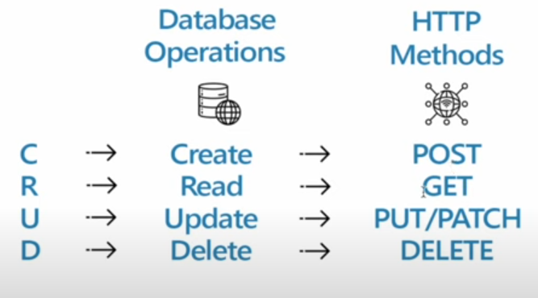

# What is HTTP in Node.js ? 🌐

HTTP (Hypertext Transfer Protocol) is a protocol that allows for communication between a client and a server over the internet. In the context of Node.js, it is commonly used to create web servers or to make HTTP requests to other servers.

- **HTTP Request:** When a client wants to communicate with a server, it sends an HTTP request.

- **HTTP Response:** The server responds to the client's request with an HTTP response.


### HTTP Headers

They provide essential metadata about the HTTP request or response, influencing how data is processed and delivered between a client (like a web browser) and a server.

**Request Headers:**
Request headers are sent by the client (browser, mobile app, etc.) to the server as part of an HTTP request.

They provide additional information about the request, the client, and what kind of response the client will accept.

Access request headers using `req.headers`. This is an object containing all the headers sent by the client.

```javascript
app.get('/', (req, res) => {
console.log(req.headers);
  // Example output:
  // {
  //   'user-agent': 'Mozilla/5.0 ...',
  //   'accept-language': 'en-US,en;q=0.9',
  //   'referer': 'https://example.com',
  //   ...
  // }
});
```

<br>

**Response Headers:**

Response headers are sent by the server (your Express.js app) back to the client.

They provide additional information about the response, like its type, how to cache it, or set cookies.

Set response headers using `res.set()` or `res.header()`

*NOTE:* Always add X to the custom headers.

```javascript
app.get('/api', (req, res) => {
  res.set({
    // Standard headers
    'Content-Type': 'application/json',
    'Cache-Control': 'no-cache, no-store, must-revalidate',

    // Custom headers
    'X-MyName': 'XYZ'              // 'X' denote its a custome header
    'X-Custom-Header': 'Hello from server'
  });
  res.json({ message: 'Hello, World!' });
});
```

## How can we create a server in Node.js ?

```javascript
import http from "http";        // in-built module

// Create a server object
const server = http.createServer((req, res) => {
  res.statusCode = 200;
  res.setHeader("Content-Type", "text/plain");
  res.end("Hello World\n");
});

const PORT = 3000;
server.listen(PORT, () => {
  console.log(`Server running at ${PORT}`);
});
```

## HTTP Methods

HTTP defines several methods that indicate the desired action to be performed on the resource:

- **GET:** Requests a representation of the specified resource. Requests using GET should only retrieve data from the server.

- **POST:** Submits data to be processed to a specified resource. Often causes a change in state or side effects on the server.

- **PUT:** Replaces all current representations of the target resource with the request payload.

- **DELETE:** Deletes the specified resource.

- **HEAD:** Similar to GET but only transfers the status line and header section.

- **PATCH:** Applies partial modifications to a resource

<p align="center">

</p>


## HTTP Status Code
Status codes indicate the result of the server's attempt to fulfill the client's request.

- **100 (Informational):** Request received, continuing process.

- **200 (Success):** The action was successfully received, understood, and accepted.

- **300 (Redirection):** Further action must be taken to complete the request.

- **400 (Client Error):** The request contains bad syntax or cannot be fulfilled.

- **500 (Server Error):** The server failed to fulfill an apparently valid request. An "Internal Server Error".


## How HTTP Works ?

- **Client Sends Request:** The client, usually a web browser, sends an HTTP request to the server. This request includes the HTTP method, the requested URL, headers, and possibly a body.

- **Server Processes Request:** The server receives the request, processes it (e.g., querying a database, reading a file), and prepares an HTTP response.

- **Server Sends Response:** The server sends the HTTP response back to the client. This response includes a status line, headers, and a body containing the requested resource.

- **Client Receives Response:** The client receives the response and processes it. For a web browser, this typically involves rendering the HTML, executing JavaScript, and displaying the content to the user.

### Image


<br>
<br>

--- 📄 Document End 🎉 -----
